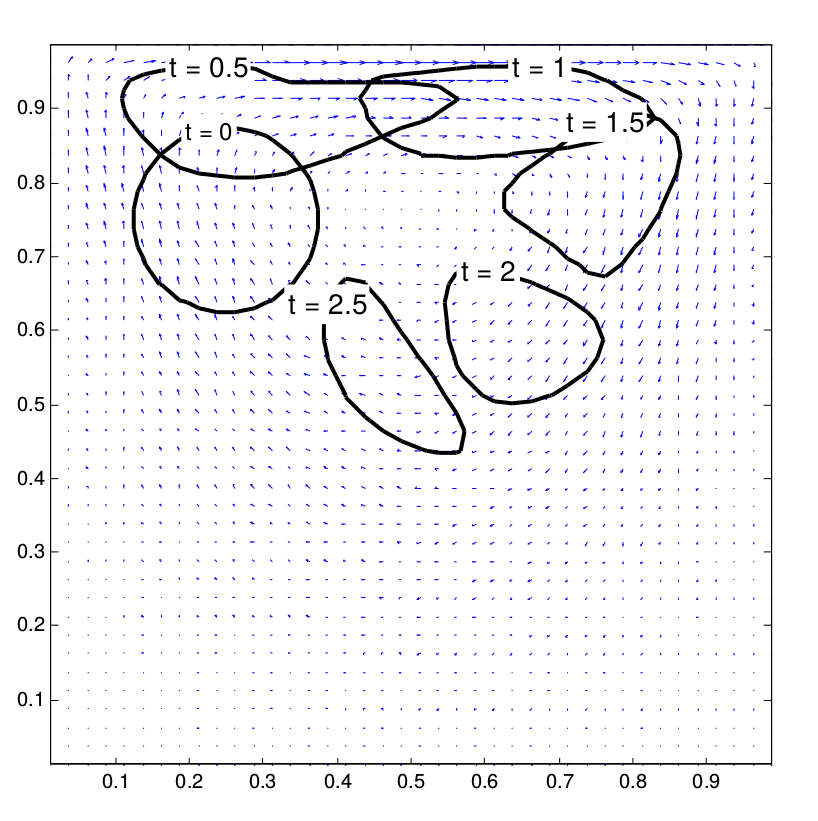

# Multiphase flow lattice-Boltzmann solver



This repository contains an implementation of the immiscible multiphase flow simulation method as suggested by Thömmes et al. [1]. It is based on the Lattice Boltzmann and the Level Set Method and was presented as
the project work of Daniel Zint's and my Honours Degree.
For a short description see [here](http://www.bgce.de/curriculum/projects/hufnagel_zint_2015/).

### Usage
Adapt `ian_mitchell-toolbox/lbm/addPathToKernel.m` to your system before running 
```
ian_mitchell-toolbox/lbm/main.m
```
Various parameters can be adapted in `main.m`.

The code makes use of the [Level Set Toolbox](https://www.cs.ubc.ca/~mitchell/ToolboxLS/) by Ian Mitchell.

[1] G. Thömmes, J. Becker, M. Junk, A.K. Vaikuntam, D. Kehrwald, A. Klar, K. Steiner, A. Wiegmann, A lattice Boltzmann method for immiscible multiphase flow simulations using the level set method, J. Comput. Phys. 228 (2009), 1139-1156. 

